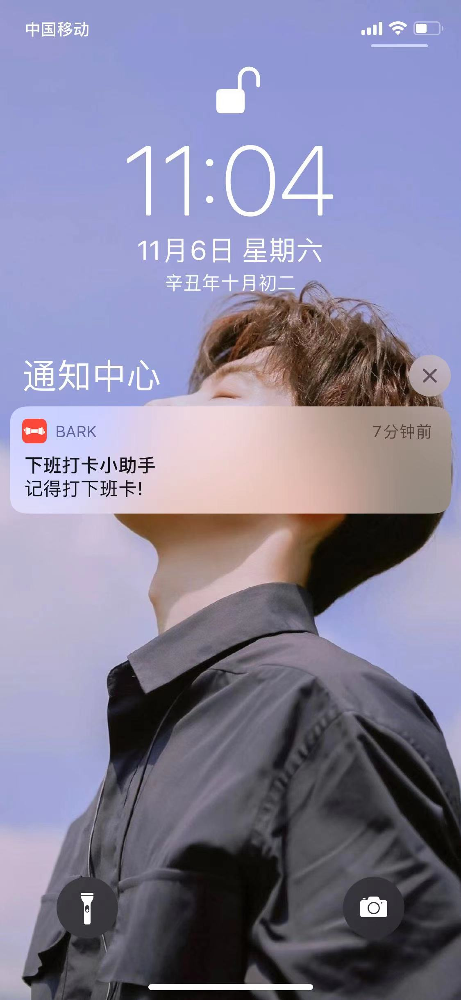

# 下班打卡小助手

女友尝试过许多方案，但还是经常忘记下班打卡，因此有了这个小工具，会在下班的时候推送消息给她的 iphone 提醒打卡。

1. 到下班点定时推送提醒
2. 在客户端（网页）执行 `确认打卡` 操作或 `推迟打卡` 操作
3. 若到点未进行操作，则会每隔一分钟推送一次提醒
4. 若执行 `确认打卡` 操作，则今日不再提醒
5. 若 `推迟打卡`，则在推迟的时间点继续执行上述操作

# 使用

> 只支持推送给 iphone

- 手机上下载 [Bark](https://github.com/Finb/Bark) 客户端，可在客户端内获得一个 token
- 修改 `config.json`，进行提醒时间等信息的设置
- 下载项目依赖：`npm install`
- 启动项目：`npm start`
- 访问 `http(s)://[ip]:[port]` 即可访问操作页面

# 预览

**打卡提醒**

**客户端操作**

